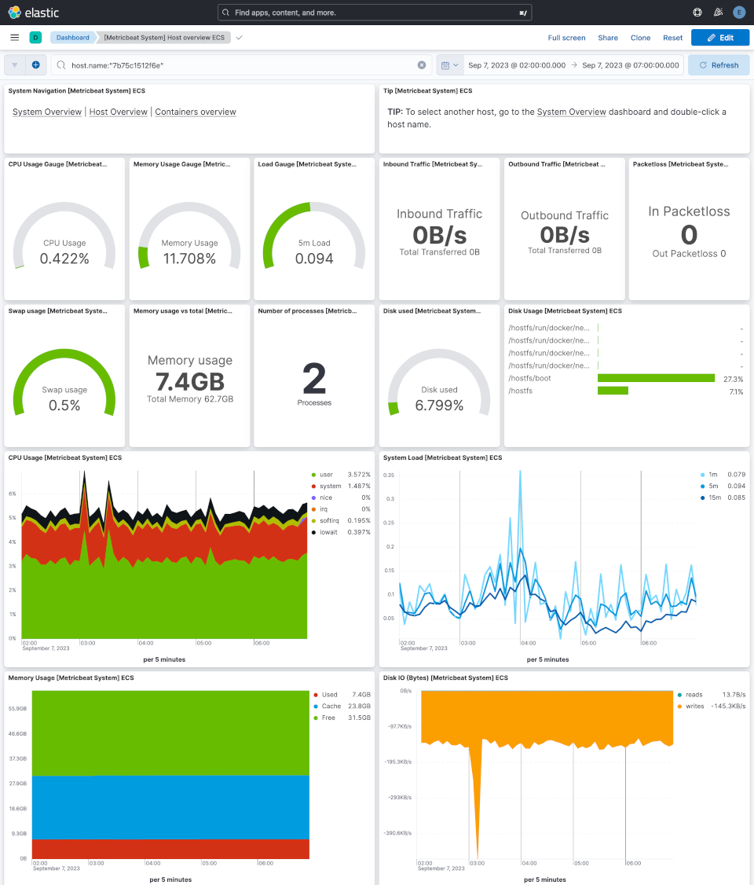
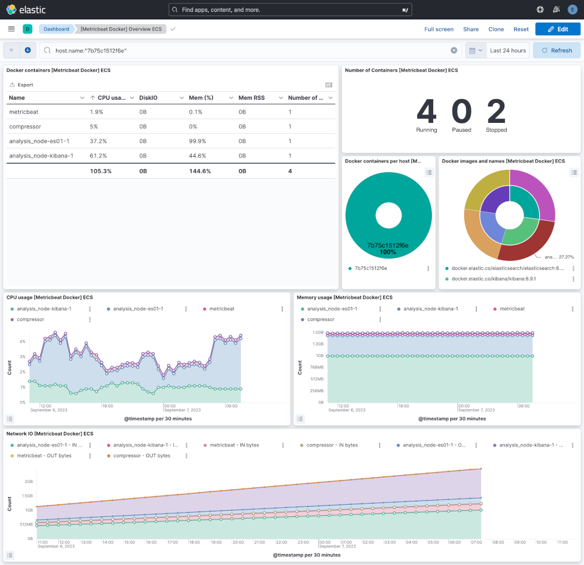

# Benchmarking

## Purpose

This project is a benchmarking solution to:
- record system and docker metrics on a node (named `monitored_node`) 
  - this node might have no Internet connectivity and limited computing / memory
- exploit those metrics on another node (named `analysis_node`) with dashboards for manual interpretation





Many use-case are possible, our first one was to record monitoring data on a Pi Zero (`monitored_node`) running our offpost,
while performing various activities on the web interface (browse Zims, ...). Since the Pi Zero 
is used as a Hotspot (i.e. no Internet and very limited network connectivity) and has limited 
computing power, we need a stack which is lightweight and capable to record data for further analysis
on any other machine with bigger CPU / RAM (`analysis_node`). We also need this architecture to limit
the impact of the monitoring stack on the monitored device.


## Overview

Elastic `metricbeat` has been selected to record system and docker activity on the `monitoring_node`. It has the advantage
to be able to output recorded data in `ndjson` files, which can be saved on local storage for persistence and transfered afterwards to the `analysis_node`. It is also very efficient in terms of computing / memory requirements.

We had to compliment the `monitored_node` with a `compactor` which is responsible to compact rotated
`ndjson` files. Elastic `metricbeat` is capable to rotate files but does not compact rotated ones automatically.
These files are however very good candidates for compaction, achieving up to x10 compaction rate with default
GZip compaction.

On the `analysis_node` side, `elasticsearch` and `kibana` are the natural solution to easily exploit `metricbeat` data. Dashboards are ready to use to interpret most `metricbeat` datasets, and feeding `ndjson` files into `elasticsearch` is almost straightforward.

## Howto

This section describes how to use the stack.

### Retrieve source code

Retrieve this repo source code on `monitored_node` and `analysis_node` via git clone, curl a zip release, ...

If `monitored_node` has no Internet access, it is not straightforward. In our case, we simply get the SD Card from the Pi Zero and plug it to another Pi (3/4/...) with Internet access. Then we retrieve what is needed (**do not forget also to pull Docker images**) and re-plug the SD Card back into the Pi Zero.

### Start the stack on `monitored_node`

Run the docker-compose stack:
```
cd monitored_node
docker compose -p bench up -d
```

By default, Metricbeat recorded data will be placed in `monitored_node/output`, and compressed by `compactor` in an `monitored_node/output/compressed`. Feel free to change this in `monitored_node/docker-compose.yml`.

### Stop the stack on `monitored_node`

Stop the docker-compose stack:
```
cd monitored_node
docker compose -p bench down
```

### Start the stack on `analysis_node`

Change to appropriate directory:
```
cd analysis_node
```

Adapt environment variables in `analysis_node/.env` (e.g. passwords).

Load it into your shell session:
```
set -a; source .env; set +a 
```

Run the docker-compose stack:
```
docker compose -p bench up -d
```

This will start:
- `es01`: an elasticsearch node, accessible on http://localhost:9200
- `kibana`: a kibana node, accessible on http://localhost:5601 (use the `elastic` user with appropriate password)
- some setup containers:
  - `manual-setup`: container responsible to create the `kibana_system` user and password
  - `metricbeat-setup`: container responsible to setup metricbeat datastream and index template in ElasticSearch and dashboards in Kibana (this is done via metricbeat source code)
  - `wait-for-me`: _hack_ container to not consider that docker-compose stack is up until all others containers are healthy or succesfully completed
- `uploader`: a helper container which will upload metricbeat data placed in the `analysis_node/input` folder to elasticsearch through the appropriate datastream

### Upload data

Once the stack is up and running, you have to load data from `monitoring_node` to Elasticsearch. Simply retrieve this data from `monitored_node/output` and copy it to the `analysis_node/input` folder. After at most 10 secs, `uploader` will start to push it to Elasticsearch. Everytime a file is uploaded, a companion file with the `.done` suffix is created, so that this file is not processed again.

### Investigate dashboards

You can now investigate monitoring data through Kibana dashboards on http://localhost:5601 (use the `elastic` user with appropriate password).

Most usefull dashboard with default `metricbeat` configuration from this repo are:
- `[Metricbeat System] Overview ECS`: if you have multiple hosts that have been monitored, you will be able to focus on only one host
- `[Metricbeat System] Host overview ECS`: view details about one host activity
- `[Metricbeat Docker] Overview ECS`: view details about Docker containers activity